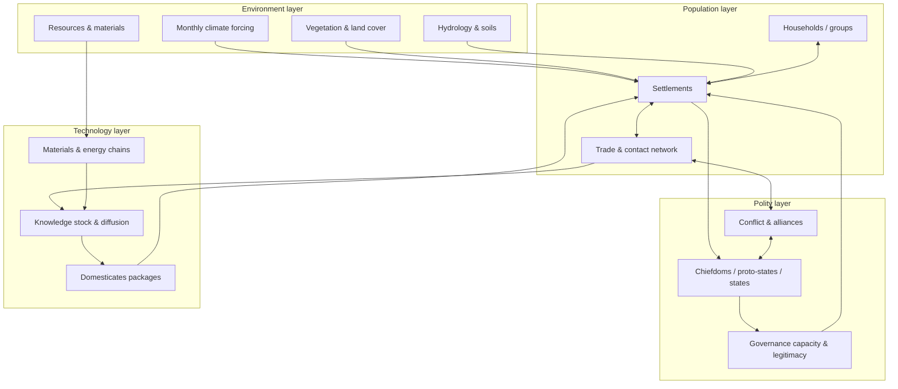
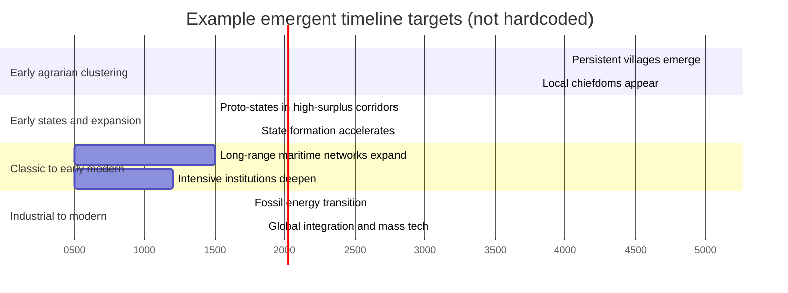

# Maximum-Realism Design for a 5000 BCE to 2025 CE Human-Society Simulation

## Executive summary

A 5000 BCE start that avoids hardcoded winners is achievable if “hard constraints” are limited to biophysics, materials, and information/transport limits, while everything else emerges from local interactions across many stochastic runs. The key design move is to begin with **people and settlements**, not “states,” and to let **polities emerge** as a measurable property of settlement networks (control, tribute, enforcement reach) rather than as a starting entity. This aligns with classic archaeological framing that early humans lived in autonomous villages/bands for a long span and that states appear later as a consequence of aggregation dynamics, not as an initial condition. citeturn6search14turn3search27

For environmental realism around 5000 BCE (about 6950 years BP relative to 1950), static “mid-Holocene” snapshots (6 ka BP) are useful but not perfectly aligned in time. A higher-fidelity approach uses **transient paleoclimate** products (monthly fields through time) and validates them against **proxy syntheses** (pollen biomes, speleothem isotopes, water isotopes), so the simulation’s agricultural ceilings and shocks are not artifacts of a hand-coded map. citeturn1search33turn1search13turn1search6turn8search0turn8search6

A historically grounded “domesticates and diffusion” subsystem is usually the biggest realism multiplier in 5000 BCE starts. Instead of a single “agriculture tech,” represent crop-livestock packages with ecological constraints and diffusion along travel-cost surfaces. Archaeological syntheses and diffusion-rate work provide calibratable targets (for example, European early farming spread around 1 km/year in many reconstructions; domesticated rice spread rates in East and Southeast Asia have been estimated around 0.72 to 0.92 km/year in one study). citeturn2search18turn2search1turn2search0

For long-run realism to 2025 CE without scripting outcomes, the model needs explicit transitions in transport, energy, materials, and institutions, but these should be triggered endogenously by prerequisites and incentives rather than by date-based “era switches.” Validation should be distributional and multi-objective (ensemble outputs compared to benchmark distributions from HYDE, Seshat, paleoclimate proxies, and modern observational datasets), using pattern-oriented calibration and likelihood-free inference approaches that are common in complex agent-based modeling. citeturn0search0turn0search1turn9search9turn9search13turn9search0

## Realism targets and design principles

A useful definition of “about 90% realism” for this kind of simulation is: across a broad benchmark suite, the model reproduces the **major statistical regularities** of human settlement, polity formation, technology diffusion, and population dynamics, while not being tuned to reproduce any specific named civilization or historical boundary map.

A practical realism score can be implemented as a weighted average of distances between simulated and empirical distributions and trajectories, evaluated on ensembles:

- settlement-size distributions and rank-size slopes by region and era
- time-to-first persistent villages, towns, cities, and city-like clusters
- diffusion speeds of key domesticates and key transport technologies
- distributions of polity sizes, durations, and fission/fusion rates
- long-run population levels and land-use intensity, compared to reconstructions
- climate-sensitive productivity patterns consistent with proxy-validated climate and vegetation

This is aligned with the “generative” view in agent-based modeling: the goal is to reproduce macroscopic social structure from plausible microscopic rules, then validate against multiple patterns rather than a single target. citeturn3search27turn9search9turn9search13

Two design rules keep you out of outcome-hardcoding:

- **Hard constraints**: physics, geography, climate forcing, material properties, biology of crops/animals/pathogens, and universal transport limits.
- **Soft priors**: uncertain parameters with wide ranges and Bayesian or pattern-oriented calibration, never fixed values chosen to force a region to win. citeturn9search9turn9search0turn9search20

Open items that strongly affect feasibility and “how realistic you can get” include: map resolution and projection, intended timestep policy (annual vs seasonal vs monthly), compute budget, whether people are represented as individuals or households, and whether the environment is exogenous (data-driven) or coupled back to human land use.

## Emergent model architecture across micro, meso, and macro scales

### Scales and entities

A high-realism configuration usually uses three coupled layers:

**Microscale (agents, local decisions)**  
Agents represent households or small kin groups, because individual-level fidelity is expensive and often unnecessary over 7,000 years. Household agents decide on foraging/farming mix, storage, migration, fertility decisions, alliance/feud posture, and whether to invest in specialists.

**Mesoscale (settlements and networks)**  
Settlements emerge as spatial clusters of households with shared storage, defense, and exchange. A settlement has infrastructure stocks (granaries, irrigation works, boats, roads), social cohesion, and a local “knowledge pool.”

**Macroscale (polities, technology systems, global diffusion)**  
Polities are emergent control graphs spanning multiple settlements. A polity is not a “country” but an outcome: a settlement that can reliably extract resources and enforce rules over other settlements within a reachable travel-time radius.

This layered approach mirrors how large-scale cultural evolution models and macro-historical datasets operationalize complexity and polity structure, while still allowing bottom-up emergence. citeturn6search23turn0search21turn6search39

### Recommended polity naming and emergence taxonomy

Avoid “country” near 5000 BCE. Use a lifecycle vocabulary:

- **group**: mobile band or household cluster
- **community**: persistent settlement with shared storage and routines
- **chiefdom**: multi-community hierarchy with tribute and leadership legitimacy
- **proto-state**: enforceable taxation or labor drafts plus administrative specialization, but fragile
- **state**: stable centralized authority spanning many communities with reliable extraction and enforcement capacities

This is consistent with common archaeological definitions that emphasize central authority, multi-community integration, and coercive capacity. A classic statement discusses the transition from autonomous villages over deep time to the later formation of states as aggregation accelerates. citeturn6search14

### Rules for emergence, fusion, fission, and control decay

A non-hardcoded polity module can be defined by measurable thresholds:

**Control decay with distance**  
Define effective control as a function of **travel time**, not Euclidean distance:

- compute travel-time surfaces from friction (terrain slope, rivers/coasts, seasonal passability) using cost-distance methods
- set control to decay with travel time, for example \( C(t) = e^{-t / \tau} \), where \( \tau \) increases with transport tech (boats, pack animals, roads) and admin tech (writing, accounting)

Cost-distance travel modeling commonly uses slope-sensitive speed functions (often variants of Tobler-style functions) and terrain friction surfaces. citeturn4search13turn4search33

**Emergence**  
A settlement becomes the center of a chiefdom or proto-state when, for a sustained duration:

- surplus is large enough to support non-food specialists
- defense success rate exceeds a threshold (deterrence)
- extraction routines (tribute/tax/labor) are stable under shocks
- administrative capacity exceeds the entropy of the controlled network (a function of nodes, travel time, and conflict)

**Fusion**  
Two polities fuse when the expected gains from reduced border conflict and integrated trade exceed the costs of legitimacy loss and admin overload.

**Fission**  
A polity splits when peripheral settlements’ defection incentives exceed enforcement capacity, particularly after climate shocks, epidemic shocks, or victorious rivals. Fission should be common early and rarer later as transport and information improve.

These dynamics map well onto coercion and warfare-centered theories (circumscription and inter-polity competition) and can be tuned without encoding geography-specific outcomes. citeturn6search2turn6search23

### Exploration and discovery without scripting

To support scouts, explorers, and “discoveries” as emergent behaviors:

- represent each settlement and polity as having a **knowledge map** with uncertainty
- allow “exploration missions” to be spawned when the value of information exceeds the opportunity cost of labor and risk
- reward exploration by reducing uncertainty in nearby resource fields, routes, and neighbor states, improving subsequent migration and trade decisions

Exploration becomes more frequent as maritime and overland transport costs fall and as polities can afford specialists and risk-bearing missions.

## Earth system and hard constraints you can edit safely

A realistic simulation needs the environment to be both **structured** (Earth geography matters) and **variable** (mean plus variance plus fat-tailed shocks). The safest way to allow “editing constraints” is to treat climate and land cover as scenario inputs, then expose parameter knobs as perturbations on those inputs.

### Climate forcing, seasonality, and variance

**Why it matters**  
Seasonality and interannual variance determine failure risk and surplus stability, which are crucial for settlement persistence, storage needs, and political centralization. Mid-Holocene climate differs from late-Holocene and present, and modern distributions can be misleading as a 5000 BCE baseline. citeturn0search7turn1search33

**Recommended data sources to prioritize**

- **Transient climate** (monthly, time-evolving): entity["organization","TraCE-21ka","ccsm3 transient 22ka-1990"] provides a coupled transient simulation from about 22 ka BP to 1990 CE, with monthly output. citeturn1search33  
- **High-resolution downscaled transient climate**: CHELSA-TraCE21k provides monthly, high-resolution reconstructions in centennial steps, intended to represent temperature and precipitation distributions through time at unprecedented spatial resolution. citeturn1search13turn1search1  
- **Snapshot ensembles for mechanism checks**: PMIP4 mid-Holocene experiment protocols and ensembles help benchmark large-scale features like monsoon shifts and temperature patterns in 6 ka simulations. citeturn0search3turn0search7  
- **Downscaled snapshot surfaces**: PaleoClim provides downscaled surfaces and derived bioclim variables including seasonality. citeturn1search0

**Proxy validation datasets**

- pollen biome reconstructions at 6 ka, such as BIOME 6000 releases archived by NOAA NCEI. citeturn1search6turn1search2  
- speleothem isotope syntheses (SISALv2) for hydroclimate evaluation and dating uncertainty handling. citeturn8search0  
- global water isotope databases (Iso2k) for hydroclimate patterns during the Common Era and for model-proxy comparisons. citeturn8search6turn8search2  
- paleoecology repositories like Neotoma for pollen and related archives. citeturn1search23turn1search11

**Algorithms and parameterization**

- represent climate as monthly fields \((T, P)\) and derive growing degree days, moisture balance, and extreme-event indicators
- represent shocks as a mixture: sampled directly from transient variability and augmented with stochastic “tail events” calibrated to proxy variability
- for editing constraints: provide scenario knobs such as “monsoon strength multiplier,” “ENSO variance multiplier,” or “volcanic-like cooling pulses,” applied as perturbations to monthly fields while keeping spatial structure

image_group{"layout":"carousel","aspect_ratio":"16:9","query":["TraCE-21ka climate simulation map","PMIP4 mid-Holocene precipitation anomaly map","BIOME 6000 6 ka vegetation reconstruction map","HYDE 3.2 population density map 5000 BC"],"num_per_query":1}

### Land cover, soils, hydrology, and water management

**Why it matters**  
Irrigation and soil water management can increase yields but also create long-run failure modes (salinization, waterlogging, infrastructure maintenance burdens). This is a crucial realism constraint because it prevents “permanent yield” assumptions. Computational modeling work has explicitly treated salinization dynamics in irrigation agriculture in Mesopotamia-like settings. citeturn5search4turn5search16

**Data sources**

- LandCover6k provides archaeological frameworks and emerging reconstructions for land use and land cover intended for climate modeling and long-run human-environment studies. citeturn4search0turn4search24  
- HYDE 3.2 provides spatially explicit reconstructions and allocation algorithms for population and land use across the Holocene. citeturn0search0  
- proxy-based syntheses and model evaluations from pollen and related archives (BIOME 6000, Neotoma) support vegetation plausibility checks. citeturn1search6turn1search23

**Algorithms**

- hydrologic suitability: compute runoff proxies and river-network-based floodplain productivity
- irrigation works: treat canals and levees as capital stocks with decay, maintenance labor, and failure risk
- salinity: couple irrigation intensity and drainage conditions to salt accumulation and yield penalty, calibrated to literature-based stylized dynamics and archaeological narratives, rather than hardcoded region outcomes. citeturn5search4turn5search8

### Disease ecology as a persistent productivity constraint

**Why it matters**  
Disease is not just random shocks. In many environments it is a chronic tax on labor productivity, fertility, and survival, especially where vectors thrive. That tax can offset high average agricultural potential, preventing “tropics always win” artifacts.

**Recommended modeling approach**

- Use ecology-driven transmission potential fields for vector-borne disease, parameterized with empirically derived thermal responses where available.
- For malaria-like dynamics, temperature-dependent transmission models predict an optimum around 25°C and sharp declines above roughly 28°C in one influential synthesis, which is directly useful for defining a nonlinear productivity tax in hot places. citeturn4search6turn4search2  
- Use a Ross-Macdonald family compartment model as a controllable core, then couple to seasonal climate and human density. citeturn4search3turn4search15

**Calibration targets**

- ensure the disease module generates stable high-burden zones in plausible climates and also allows escape via technology and institutions (drainage, housing, repellents, quinine-like interventions later)
- do not calibrate to modern disease maps directly, but use modern physiological constraints plus historical plausibility

## Socio-technical evolution without hardcoded tech winners

### Domesticates and crop-livestock packages with diffusion

**Why it matters**  
At 5000 BCE, the world is not “uniformly agricultural.” What matters is which domesticates are available locally and how quickly they spread through contact, migration, and trade. Archaeological syntheses emphasize origins, diffusion, and varied trajectories, supporting a package-based model rather than a universal tech tree. citeturn2search0turn2search3turn2search35

**Core design**

Represent each **package** as a set of traits:

- crops: caloric yield curve, labor curve, storage curve, seasonality, climate envelope
- livestock: meat, milk, traction, manure, transport value, disease interactions
- processing: milling, pottery, storage, fermentation
- risk profile: sensitivity to drought timing, flood timing, pest losses

Then diffusion happens via:

- demic diffusion (migration and settlement founding)
- cultural diffusion (adoption without migration)
- elite and coercive diffusion (imposed practices through conquest and tribute)

**Empirical diffusion-rate benchmarks**

- Early farming spread rates across Europe have often been summarized around 1 km per year in wave-of-advance style reconstructions, providing a calibration target for land diffusion under low transport tech. citeturn2search18turn2search34  
- One analysis estimated domesticated rice spread rates in eastern and southeastern Asia around 0.72 to 0.92 km/year, offering a second, independent calibration benchmark for crop diffusion. citeturn2search1  
- Archaeobotanical databases have been used to trace translocations of western Asian crops eastward across Central Asia, which can validate timing and corridor dependence of diffusion. citeturn2search29

**Algorithms**

- diffusion on a friction surface: reaction-diffusion or agent-mediated spread, with diffusion coefficient tied to mobility and contact intensity
- adoption decision: bounded rational choice or cultural transmission rules (conformist bias, prestige bias) informed by cultural evolution theory. citeturn6search1turn6search12

### Transport, haulage, and maritime technology as endogenous unlocks

**Why it matters**  
Transport determines market size, war radius, administrative reach, and diffusion speed. If transport is too easy early, the richest region converts surplus into tech too reliably.

**Ground transport baseline and algorithms**

- use travel-time friction surfaces and cost-distance networks; slope-dependent speed functions and off-path multipliers are standard tools in accessibility modeling. citeturn4search13turn4search33  
- model pack animals and traction as discrete unlocks that reduce friction and increase cargo capacity, consistent with “secondary products” discussions of traction and animal exploitation shifts. citeturn10search2turn10search16  
- calibrate the emergence of traction with archaeozoological evidence where available (for example, traction evidence in mid-4th millennium BC Ireland in one study), keeping it as an emergent pathway rather than a date trigger. citeturn10search23

**Wheels and wheeled vehicles**

- treat wheeled transport as a later innovation with prerequisites in woodworking, metallurgy, traction animals, and roads.
- general syntheses place early evidence for wheeled transport around the late 4th millennium BCE, with iconic Mesopotamian pictographs dated around 3500 BCE mentioned in a reference work, and scholarly review placing early evidence as near-contemporary across regions. citeturn11search0turn11search6

**Maritime**

- model waterborne movement separately: rivers, coasts, open sea.
- early watercraft existence is well supported in archaeology, including Neolithic Mediterranean boats documented in recent work, which supports allowing substantial coastal mobility well before large states. citeturn10search10turn10search14  
- keep true blue-water trade as a function of specialized shipbuilding and navigation knowledge, not as a default.

### Energy and materials chains

**Why it matters**  
Technology is chained. Surplus alone cannot produce metallurgy without fuel, ore access, skilled labor, and learning networks. This prevents monotonic “food -> tech” behavior.

**Implementation approach**

- represent each major production chain as a directed acyclic graph of inputs, intermediates, and constraints: fuel (biomass, charcoal, later coal and oil), furnaces/kilns, ores, fluxes, tooling, specialist labor
- allow chains to emerge locally based on resource co-location and sufficient surplus to support specialists and experimentation

**Calibration anchors**

- archaeometallurgical evidence places early copper mining and smelting in specific regions and times; for example, literature reviews discuss early metallurgy in southeastern Europe with mining and smelting evidence in the 6th to 5th millennia BCE range as summarized in a recent open article. citeturn5search9turn5search29  
- use such evidence to calibrate plausible prerequisites and to ensure metallurgy does not appear everywhere at once.

### Institutions, state capacity, and information technology

**Why it matters**  
A settlement system can grow large yet fail to become a “state” if it cannot coordinate taxation, enforcement, and infrastructure maintenance. Warfare-based cultural evolution models and circumscription theory both provide mechanisms that can be implemented without hardcoding who wins. citeturn6search23turn6search2turn6search14

**Algorithms**

- treat institutions as cultural traits with costs and benefits; adoption increases group competitiveness under inter-polity conflict pressure, consistent with cultural evolutionary framing. citeturn6search23turn6search12  
- represent admin capacity as a stock that grows with surplus and specialists but is capped by information tech (writing, accounting) and communication travel times

**Validation datasets**

- entity["organization","Seshat: Global History Databank","cliodynamics 2015 dataset"] provides coded data on polities and social complexity used to test theories about cultural evolution and historical dynamics, and is explicitly designed for such comparative validation. citeturn0search1turn0search21  
- Use Seshat-derived distributions (polity population, territorial scale, hierarchy measures, infrastructure proxies) as ensemble targets, without tuning to match any specific polity’s history.

### Knowledge transmission and knowledge loss

**Why it matters**  
In premodern contexts, knowledge is often local, apprenticeship-bound, and vulnerable to collapse. This makes trajectories path-dependent and prevents deterministic monotonic progress.

**Model**

- each settlement has a knowledge stock by domain (agronomy, metallurgy, navigation, medicine)
- transmission occurs through migration, trade contact, intermarriage, raiding, and prestige imitation, consistent with social learning biases in cultural evolution frameworks. citeturn6search1turn6search12  
- knowledge decays when specialist populations fall below maintenance thresholds or when trade links collapse

## Stochasticity, ensembles, calibration, and validation benchmarks

### Why ensembles are mandatory

Because the system is nonlinear and shock driven, single runs are not meaningful. Model credibility should be based on ensemble distributions. This is also standard practice in climate modeling and in agent-based validation practice. citeturn0search7turn9search3

### Calibration approach that avoids outcome-hardcoding

Use multi-pattern calibration:

- **Pattern-Oriented Modeling (POM)**: identify multiple observed patterns and calibrate to match them jointly, rather than fitting to one curve. citeturn9search9turn9search13  
- **Likelihood-free inference** using Approximate Bayesian Computation (ABC) for ABM parameters, with explicit warnings from recent reviews about common pitfalls and the need for validation. citeturn9search0  
- optionally combine **history matching** ideas to rule out implausible parameter regions efficiently when runs are expensive. citeturn9search20turn9search14

### Benchmark datasets and metrics

**Initial conditions and deep history**
- HYDE 3.2 for gridded population and land-use estimates over the Holocene, useful as a demographic prior and land-use plausibility check. citeturn0search0  
- LandCover6k for archaeologically informed land-use/land-cover reconstructions and classification schemes. citeturn4search24turn4search0  
- PMIP4 and transient paleoclimate products for climate forcing; validate with BIOME 6000 and SISAL. citeturn0search3turn1search33turn1search6turn8search0

**Polities and complexity**
- Seshat for distributions of polity complexity and dynamics. citeturn0search21turn0search1

**Modern era (for 1800 CE to 2025 CE validation, not as drivers)**
- entity["organization","ECMWF","era5 producer"] ERA5 for hourly reanalysis fields since 1940, supporting validation of weather variability and catastrophes in the late sim. citeturn7search2turn7search14  
- entity["organization","NOAA","ncei climate data"] GHCN-Daily for station-based daily climate observations, useful for validating extremes and trend distributions where the sim intends to represent observed weather. citeturn7search3turn7search35  
- entity["organization","United Nations","desa population division"] World Population Prospects 2024 for 1950 to present population baselines that the simulation should approximate in distribution if it aims to be realistic in the modern period. citeturn7search1turn7search5  
- Maddison Project Database 2023 for long-run GDP and population trajectories as high-level validation benchmarks for the economic subsystem after major institutional and energy transitions. citeturn7search0turn7search4

### Ensemble experiment designs

A robust suite typically includes:

- **baseline historical Earth**: best-estimate climate and land cover, domesticates diffusion enabled
- **counterfactual climates**: scaled monsoon variance, altered drought clustering, or shifted temperature baselines
- **connectivity counterfactuals**: reduced maritime tech, delayed traction, altered shipbuilding learning cost
- **path dependence stress tests**: identical environment, different random seeds for innovations and leader behavior
- **ablation tests**: remove a subsystem (disease, transport friction, knowledge loss) and quantify metric degradation

## Implementation roadmap with GPU/CPU mapping and cost-benefit

### Architecture diagram

### Timeline framing

### Subsystems table

| Subsystem | Why it matters | Suggested model/algorithm | Priority datasets | Calibration targets and parameter priors | GPU vs CPU | Realism gain vs cost |
|---|---|---|---|---|---|---|
| Climate forcing and variance | Sets yield ceilings and shock clustering | Monthly forcing fields; derived agroclimate indices; stochastic tails validated to proxies | TraCE-21ka; CHELSA-TraCE21k; PMIP4; PaleoClim; BIOME 6000; SISAL; Iso2k | Prefer transient fields near 7 ka BP for 5000 BCE; validate vegetation and hydroclimate patterns to proxies citeturn1search33turn1search13turn0search3turn1search0turn1search6turn8search0turn8search6 | GPU for gridded climate transforms | Very high gain, medium cost |
| Demographic initialization | Prevents scripted winners | Density-field computed from suitability, then scaled to target global population; stochastic sampling | HYDE 3.2 as prior; LandCover6k classifications | Fit HYDE-like spatial distributions as priors, allow run-to-run noise; no fixed region shares citeturn0search0turn4search24 | GPU for suitability maps; CPU for sampling | Very high gain, low-medium cost |
| Domesticates packages and diffusion | Core 5000 BCE realism lever | Package traits; diffusion on friction surfaces; adoption via social learning | Archaeobotanical syntheses; AsCAD-style corridor evidence | Diffusion rates: Europe farming ~1 km/yr; rice spread ~0.72–0.92 km/yr as benchmarks citeturn2search18turn2search1turn2search29turn2search0 | GPU for diffusion fields; CPU for adoption decisions | Very high gain, medium cost |
| Disease ecology | Offsets simple “best climate wins” | Vector suitability fields + Ross-Macdonald-like dynamics; chronic productivity tax | Thermal-response literature; SISAL and climate for seasonality | Malaria-like optimum around 25°C with declines above ~28°C as nonlinear constraint citeturn4search6turn4search3 | GPU for suitability; CPU for outbreaks/events | High gain, medium cost |
| Transport and maritime | Governs contact, trade, war, admin reach | Cost-distance travel-time; route networks; tech-dependent friction | Land friction + rivers/coasts; archaeological constraints on vehicles/boats | Keep bulk overland costly early; model later wheeled transport emergence around 4th millennium BCE evidence citeturn4search13turn11search6turn10search10 | GPU for cost fields; CPU for routing on sparse graphs | High gain, medium-high cost |
| Institutions and polity emergence | Enables state formation without starting states | Control graph from settlements; distance decay by travel time; legitimacy and capacity stocks | Seshat for distributions; theory papers | Validate polity size and complexity distributions; ensure fission is common early citeturn0search21turn6search23turn6search14 | CPU (graphs, events, agent decisions) | Very high gain, high cost |
| Knowledge transmission and loss | Creates path dependence and collapse | Local knowledge stocks; network diffusion; decay under specialist collapse | Cultural evolution frameworks; Seshat for complexity patterns | Use social learning biases as parameters rather than scripts citeturn6search12turn6search1 | CPU for agent networks; GPU optional for diffusion | High gain, medium cost |
| Soil and irrigation dynamics | Prevents permanent “river valley always wins” | Capital stocks with maintenance; salinity accumulation and mitigation | Irrigation and salinization modeling literature | Validate yield decline under mismanagement and stabilization under maintenance regimes citeturn5search4turn5search16 | GPU for soil fields; CPU for infrastructure decisions | Medium-high gain, medium cost |

### GPU-appropriate vs CPU-appropriate split

GPU is best for large, regular grid computations that run every timestep:

- climate downscaling transforms, agroclimate indices, seasonal drought and flood indicators
- diffusion fields for domesticates, disease suitability, pollution or deforestation
- cost-surface updates and repeated least-cost approximations (if you keep it grid-based)

CPU is best for sparse, stateful, discrete logic:

- household and leader decision-making, including exploration mission spawning
- settlement governance, fission/fusion, legitimacy shifts
- event-driven shocks (wars, collapses, epidemics when modeled as discrete outbreaks)
- sparse graph operations: trade routes, alliance networks

This split matches common practices: Earth-system style grids benefit from data-parallelism, while social systems are dominated by branching logic and sparse graphs.

### A concrete prioritized build order

A cost-effective sequencing that preserves long-run viability from 5000 BCE to 2025 CE:

1. Replace any region-share-based spawning with density-field initialization scaled to a target world population, using HYDE as a prior rather than a script. citeturn0search0  
2. Lock in climate as monthly, transient forcing for 5000 BCE onward, validated to pollen and speleothem proxies, with editable scenario perturbations. citeturn1search33turn1search6turn8search0  
3. Implement domesticates packages with friction-based diffusion and calibrate to known spread-rate benchmarks. citeturn2search18turn2search1  
4. Move from “starting states” to emergent polities by implementing control graphs with travel-time decay and capacity-limited extraction. citeturn6search14turn6search23  
5. Add chronic disease ecology as a productivity and mortality tax tied to climate and settlement density. citeturn4search6turn4search15  
6. Add exploration missions and map-knowledge uncertainty to generate exploratory behavior and discoveries endogenously.  
7. Only after the above, invest heavily in deep production chains and modern-era macroeconomics validation, anchored to UN WPP and Maddison as high-level checks, not as drivers. citeturn7search1turn7search0

### Test and benchmark suite

A simulation like this becomes credible through automated benchmarks:

- **Neolithic diffusion benchmark**: recover plausible diffusion rates and corridor dependence for domesticates on multiple continents, without region scripts. citeturn2search18turn2search29  
- **Polity emergence benchmark**: match Seshat-like distributions of polity size and hierarchy over broad eras, without matching any named polity. citeturn0search21turn6search39  
- **Land-use plausibility benchmark**: simulated land-use intensity is within uncertainty bands of Holocene reconstructions and classification constraints. citeturn0search0turn4search24  
- **Climate-proxy consistency benchmark**: simulated vegetation and hydroclimate indices are consistent with BIOME 6000 and SISAL patterns for relevant windows. citeturn1search6turn8search0  
- **Late-period sanity checks**: 1800 to 2025 CE outputs produce realistic ranges against UN population and modern climate observations, but remain emergent. citeturn7search1turn7search3

For calibration, apply pattern-oriented modeling and ABC-style inference only on parameter priors, never on outcome targets, to avoid implicit scripting. citeturn9search9turn9search0