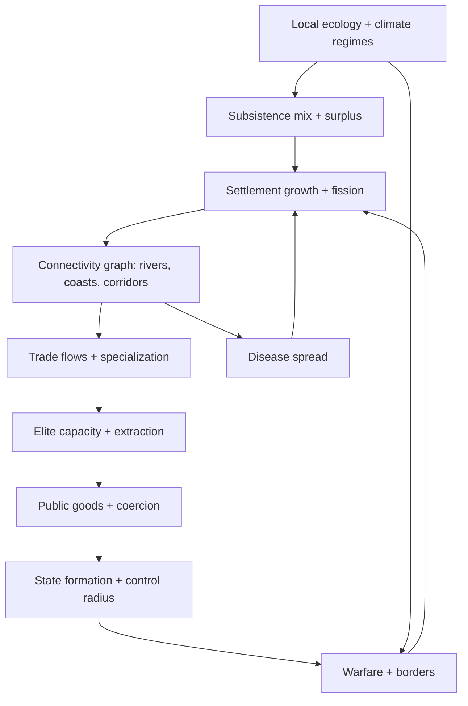
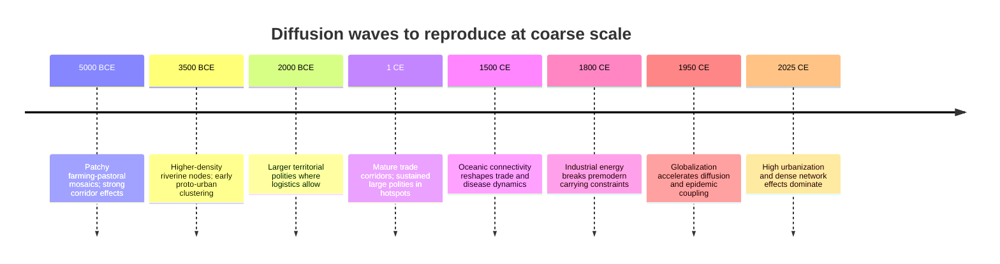

# Making a 5000 BCE World Simulation Substantially More Realistic

## Executive summary

Starting a world simulation at 5000 BCE can be made dramatically more realistic by restructuring the model around three coupled layers that remain computationally feasible over 7025 simulated years: a settlement network (meso), regionally grounded subsistence and environment constraints (micro-to-meso), and a polity layer that emerges from logistics, elites, and coercion rather than being the primary unit of causality (macro). This general architecture is consistent with how most quantitative long-run models and archaeological syntheses explain divergence: ecology and domesticates set constraints; settlements and mobility determine contact and specialization; states form when extraction, coordination, and coercion become advantageous under geography and conflict pressures (Klein Goldewijk et al., 2017; Turchin et al., 2013; Kohler et al., 2012).

The biggest realism gains for the least complexity usually come from: (a) initializing demography and land-use plausibly at 5000 BCE with regionally varying subsistence mixes, (b) representing settlements explicitly (even if households are aggregated), (c) simulating diffusion of crop and herd packages and basic technologies via mobility-weighted networks, and (d) making warfare outcomes primarily a function of campaign logistics, seasonality, and political fragmentation rather than simple “army strength” arithmetic (Klein Goldewijk et al., 2017; van Creveld, 1977; Turchin et al., 2013).

A practical target is “coarse-grained historical realism,” meaning your ensemble runs reproduce: global population and land-use trajectories; the emergence timing and spatial clustering of early complex societies; plausible distributions of polity lifetimes and sizes; and urbanization growth, while still leaving open-ended alternate paths (Klein Goldewijk et al., 2017; Taagepera, 1979; United Nations, 2022). That gives you an objective scoring function and a calibration loop rather than tuning by feel.

Key short-term deliverables that tend to shift perceived realism immediately: settlement nodes plus a gravity-based interaction graph; explicit subsistence modes and domesticate packages; multi-year climate regimes; and epidemic dynamics tied to connectivity and settlement size (Bocquet-Appel, 2011; NCEI NOAA Paleoclimatology, n.d.; Keeling & Rohani, 2008).

## Required initial conditions at 5000 BCE

### Demography and land use

**Rationale.** If global and regional population density surfaces are wrong at t = 5000 BCE, the model can still look internally coherent while producing implausible centers of early complexity, trade corridors, and conflict frontiers. Reproducing broad demographic baselines is frequently the strongest “anchor” for long-run social simulations (Klein Goldewijk et al., 2017).

**What to initialize (minimum viable realism).**
- A gridded population surface and land-use intensity proxies (cropland, pasture, built-up fraction) consistent with long-run reconstructions such as HYDE (Klein Goldewijk et al., 2017).
- Region-specific carrying capacity parameters decomposed into calories, labor productivity, and storage risk rather than a single “fertility” scalar (Winterhalder & Kennett, 2006).
- A low urbanization baseline at 5000 BCE with settlements mostly in the village scale, plus a small number of proto-urban nodes in the most productive riverine/alluvial zones when supported by your suitability layer (Childe, 1950; Algaze, 2008).

**Calibration targets and ranges (coarse anchors).**
- Global population magnitude on the order of tens of millions at 5000 BCE, with high uncertainty, but constrained by reconstruction families like HYDE and archaeological demography syntheses (Klein Goldewijk et al., 2017; Bocquet-Appel, 2011).
- Regional rank ordering of densities: major river valleys and monsoon-supported floodplains above arid interiors, high latitudes, and deserts (Klein Goldewijk et al., 2017; FAO GAEZ documentation, n.d.).
- Built-up land close to negligible; cropland and pasture present but regionally patchy and domesticate-dependent (Klein Goldewijk et al., 2017).

**Validation metrics.**
- Mean absolute error or relative error versus HYDE population totals by region and by millennium, plus spatial correlation between your density surface and reconstructed density surfaces at a few checkpoints (Klein Goldewijk et al., 2017).
- A “center of mass” diagnostics: do your modeled population centroids by macro-region drift in directions consistent with reconstructions (Klein Goldewijk et al., 2017).

### Settlement network

**Rationale.** Most “country-first” sims over-extract realism from national scalars. At 5000 BCE, the dominant structure is a settlement system. Polities are often small and fragmented; connectivity and specialization emerge from where people live and how they move (Kohler et al., 2012).

**What to initialize.**
- A set of settlement nodes with attributes: population, storage, local carrying capacity, subsistence mix, trade specialization, and local elite capacity.
- A transport-cost surface and derived network edges: rivers, coasts, steppe corridors, mountain passes, and portage penalties (Hanson, 2016; HydroSHEDS technical documentation, n.d.).

**How many nodes.**
- Enough to represent spatial heterogeneity without exploding runtime. A common compromise is “one node per inhabited cell above a density threshold,” then adaptive node splitting as population grows, or seeding nodes from suitability peaks and letting migration fill in (Kohler et al., 2012).

**Validation metrics.**
- Settlement size distribution should be heavy-tailed over time, with increasing tail weight as urbanization arises (Zipf-like regularities are common in historical city size distributions, though the fit varies by era and sampling) (Zipf, 1949; Batty, 2006).

### Subsistence mixes and domesticate packages

**Rationale.** At 5000 BCE, the most important economic differences are not “GDP.” They are subsistence portfolios, risk profiles, and mobility regimes. Agriculture is not monolithic; mixed economies and pastoral mobility create very different connectivity and conflict patterns (Bocquet-Appel, 2011; Zeder, 2011).

**Represent subsistence as a compositional state vector.**
For each settlement (or cell), track shares that sum to 1:
- foraging
- horticulture / low-intensity farming
- intensive cereal agriculture
- pastoralism
- fishing / maritime
- craft / trade-specialist labor share

**Domesticate packages as discrete bundles, not single tech flags.**
A package is a set of crops and animals plus a farming calendar and storage characteristics. Examples to encode as packages with diffusion constraints:
- Southwest Asia cereal-legume package with sheep-goat and later cattle traction effects (Zeder, 2011; Fuller et al., 2014).
- East Asian rice and millet complexes with different water and labor constraints (Fuller et al., 2014).
- African mixed packages with strong climate-seasonality sensitivity and pastoral components (Marshall & Hildebrand, 2002).
- New World packages with later intensification and very different animal traction constraints (Smith, 1997; Dillehay et al., 2007).

**Calibration targets.**
- Timing and spatial progression of package diffusion should match broad archaeological syntheses: early concentration near centers of domestication, then front-like spread modulated by transport corridors and ecological boundaries (Ammerman & Cavalli-Sforza, 1973; Bocquet-Appel, 2011).
- The Neolithic Demographic Transition signature: agricultural adoption correlates with rising local population densities, followed by stabilization as fertility and mortality regimes shift (Bocquet-Appel, 2011).

### Regional suitability maps

**Rationale.** Suitability maps are the “physics of the model.” If they are wrong, every downstream mechanic must compensate. For a 5000 BCE start, you need at least modern high-quality geography plus a mechanism for paleoclimate anomalies and hydro-constraints (NCEI NOAA Paleoclimatology, n.d.; PaleoClim, n.d.).

**Minimum layers (practical).**
- Topography and slope (for transport and agriculture constraints) (SRTM documentation, n.d.).
- Rivers, watersheds, and coastal access (HydroSHEDS documentation, n.d.).
- Soil productivity and water holding capacity proxies (SoilGrids documentation, n.d.).
- Modern climate normals as baseline plus a paleoclimate anomaly time series (WorldClim documentation, n.d.; PaleoClim documentation, n.d.; NCEI NOAA Paleoclimatology, n.d.).
- Biome or potential vegetation proxy to constrain foraging and pastoral feed availability (Ramankutty & Foley, 1999).

**How to reconcile modern maps with a 5000 BCE start.**
- Use modern geography for coastlines and topography as a baseline since post-glacial sea level is near-modern by mid-Holocene, but allow local delta and shoreline sensitivity only if your mechanics depend strongly on it (Lambeck et al., 2014).
- Use paleoclimate anomalies and multi-year regimes rather than trying to fully reconstruct 5000 BCE monthly weather globally.

## Meso and micro mechanisms to add

This section lists recommended mechanics with rationale, algorithmic sketch, calibration sources, parameter anchors, and validation metrics. The goal is not maximum fidelity at every scale. The goal is to add the smallest set of dynamics that reproduce the correct emergent patterns over 7025 simulated years (Kohler et al., 2012).

### Settlement growth and fission

**Rationale.** Settlement fission and hierarchical growth produce realistic spatialization of population, distance-limited interaction, and later urban hierarchies, without simulating individuals (Kohler et al., 2012; Batty, 2006).

**Algorithmic sketch.**
For settlement *i* with population \(P_i\):
- births-deaths net growth depends on calories per capita and crowding:
\[
\Delta P_i = P_i \cdot r(\text{cal}_i) \cdot \left(1 - \frac{P_i}{K_i}\right) - \text{shock}_i
\]
- carrying capacity \(K_i\) depends on land quality, subsistence mix, irrigation, and technology:
\[
K_i = K_{0,i} \cdot f(\text{tech}) \cdot f(\text{soil}) \cdot f(\text{water}) \cdot f(\text{storage})
\]
- fission: if \(P_i > P_{\text{split}}\) and nearby suitable land exists, spawn a new settlement with fraction \(\alpha\) of population and shared or inherited domesticate packages.

**Calibration sources.**
- HYDE for population and land-use envelopes (Klein Goldewijk et al., 2017).
- Settlement scaling and distribution literature (Batty, 2006).

**Parameter anchors.**
- \(P_{\text{split}}\) set so that at early millennia you get many small villages and few large nodes; later, with tech and institutions, splits diminish relative to growth of urban nodes (Bocquet-Appel, 2011).
- Track emerging urbanization and compare with historical urbanization reconstructions for later checkpoints (United Nations, 2022; Chandler, 1987).

**Validation metrics.**
- Settlement size distribution shape over time.
- Spatial autocorrelation of settlement density.

**Implementation example (pseudocode).**
```pseudo
for each year:
  for each settlement i:
    cal_i = food_produced(i) + food_imported(i) - food_exported(i)
    r_i = r_min + (r_max - r_min) * sigmoid((cal_i / P_i - cal0)/cal_slope)
    K_i = base_K(i) * tech_multiplier(i) * water_multiplier(i) * soil_multiplier(i)

    P_i = P_i + P_i * r_i * (1 - P_i / K_i) - shock_deaths(i)

    if P_i > P_split and has_nearby_suitable_cell(i):
      j = create_new_settlement(nearest_suitable_cell(i))
      P_j = alpha * P_i
      P_i = (1 - alpha) * P_i
      inherit_packages(j, i)
```

### Households, elites, and extraction capacity

**Rationale.** “Institutions” become realistic when they are modeled as a constrained capability: elites can extract, invest in public goods, and coerce, but only up to administrative and legitimacy limits. This is a recurring theme in comparative historical datasets and theory-driven models (Turchin et al., 2013; Seshat methodology papers).

**Algorithmic sketch.**
Represent each settlement with:
- elite share \(e_i\) (fraction of resources controlled)
- legitimacy \(L_i\)
- admin capacity \(A_i\)
- extraction rate \(\tau_i \le \tau_{\max}(A_i, L_i)\)

Budget:
\[
\text{revenue}_i = \tau_i \cdot \text{surplus}_i
\]
Allocate revenue to:
- defense and policing
- storage and irrigation
- roads and ports
- elite consumption (affects legitimacy via inequality feedback)

Legitimacy dynamics:
\[
L_{t+1} = L_t + \beta_1 \cdot \text{public_goods} - \beta_2 \cdot \text{inequality} - \beta_3 \cdot \text{tax_burden} - \beta_4 \cdot \text{defeat}
\]

**Calibration sources.**
- Seshat variables on social complexity, governance, and polity characteristics (Seshat data papers).
- Comparative state capacity and fiscal history syntheses (Dincecco, 2015).

**Parameter anchors.**
- Extraction rates low early, rising with bureaucratic and institutional development (Dincecco, 2015).
- Collapse risk increases when extraction rises faster than legitimacy and capability (Tainter, 1988).

**Validation metrics.**
- Polity lifetimes, frequency of fragmentation, and oscillations in territory size compared to known empire dynamics distributions (Taagepera, 1979).

### Migration and mobility regimes

**Rationale.** Migration is the main channel for early diffusion and frontier dynamics. Modeling it as a residual after growth is too weak. You need explicit push-pull forces plus mobility constraints by subsistence mode (Bocquet-Appel, 2011).

**Algorithmic sketch.**
Net migration from i to j:
\[
M_{ij} = m_0 \cdot P_i \cdot \underbrace{g(\Delta U_{ij})}_{\text{utility gap}} \cdot \underbrace{e^{-c \cdot d_{ij}}}_{\text{distance cost}} \cdot \underbrace{h(\text{corridor}_{ij})}_{\text{rivers/steppe/coast}}
\]
Utility \(U\) includes calories per capita, conflict risk, disease burden, and elite oppression.

For pastoral mobility: represent seasonal movement between grazing patches with a route graph; herds convert biomass to calories with climate-sensitive productivity (Marshall & Hildebrand, 2002).

**Calibration sources.**
- Neolithic diffusion modeling foundations and demographic syntheses (Ammerman & Cavalli-Sforza, 1973; Bocquet-Appel, 2011).
- Pastoralism archaeology and ethnographic constraints (Marshall & Hildebrand, 2002).

**Validation metrics.**
- Speed of farming frontier spread in broad regions.
- Persistence of steppe pastoral corridors and their role as high-connectivity belts.

### Trade caravans, ports, and craft specialists

**Rationale.** Pre-modern “growth” is largely about specialization and exchange under transport costs. Adding explicit port and caravan mechanics can replace many unrealistic global-market shortcuts (Hanson, 2016).

**Algorithmic sketch.**
Use a gravity trade model on the settlement graph with capacity constraints:
\[
F_{ij} = \kappa \cdot \frac{S_i^\alpha S_j^\beta}{(C_{ij})^\gamma}
\]
Where \(S\) is tradable surplus and \(C_{ij}\) is generalized cost (distance, terrain, piracy risk, border friction).

Ports reduce \(C_{ij}\) strongly along coastal edges; navigable rivers reduce costs inland.

Craft specialists emerge when local demand and market access exceed thresholds:
- specialist share increases with market size and connectivity:
\[
\Delta s_i = \eta \cdot \text{market\_potential}_i - \lambda \cdot \text{subsistence\_risk}_i
\]

**Calibration sources.**
- Archaeological trade network approaches and least-cost mobility models (Hanson, 2016).
- ComSES model library examples of trade and exchange ABMs.

**Validation metrics.**
- Emergence of persistent trade hubs in plausible geographic locations (river deltas, straits, caravan crossroads).
- Inequality and urban growth correlations with connectivity.

### Disease transmission at settlement scale

**Rationale.** Epidemics are not just random shocks. They depend on population density, connectivity, seasonality, and animal-human interfaces. Settlement-scale SIR dynamics tied to the travel graph improves realism dramatically and is computationally cheap (Keeling & Rohani, 2008).

**Algorithmic sketch.**
Per settlement i, compartmental model with coupling between settlements:
\[
\frac{dS_i}{dt} = -\beta_i \frac{S_i I_i}{N_i} - \sum_j \phi_{ji} \beta_{ji} \frac{S_i I_j}{N_j}
\]
\[
\frac{dI_i}{dt} = \beta_i \frac{S_i I_i}{N_i} + \sum_j \phi_{ji} \beta_{ji} \frac{S_i I_j}{N_j} - \gamma I_i
\]
\[
\frac{dR_i}{dt} = \gamma I_i
\]
Where \(\phi_{ji}\) is traveler flow from j to i derived from your trade and migration model.

Add zoonotic emergence probability increasing with:
- animal density near settlements
- market connectivity
- climate regime shifts

**Calibration sources.**
- Infectious disease modeling references (Keeling & Rohani, 2008).
- Historical demography and plague wave literature for later eras.

**Validation metrics.**
- Fat-tailed mortality shock distribution.
- Correlation between connectivity hubs and epidemic seeding.

**Implementation example (pseudocode).**
```pseudo
for each substep in year (e.g., 12 months):
  for each settlement i:
    inflow_I = sum_over_j(flow[j->i] * I_j / N_j)
    beta_eff = beta0 * density_factor(i) * climate_factor(i)

    new_inf = beta_eff * S_i * (I_i / N_i + inflow_I)
    new_rec = gamma * I_i

    S_i -= new_inf
    I_i += new_inf - new_rec
    R_i += new_rec
```

### Multi-year climate regimes, soil fertility, and irrigation

**Rationale.** Year-to-year white noise rarely reproduces real collapses and regional divergence. Multi-year drought regimes, soil depletion, and irrigation investments create path dependence and clustered crises (NCEI NOAA Paleoclimatology, n.d.; Tainter, 1988).

**Algorithmic sketch.**
Model climate as a regime-switching process:
- regimes: normal, drought, pluvial, cold spell
- transition matrix with persistence (Markov):
\[
P(\text{regime}_{t+1} \mid \text{regime}_t)
\]
Each regime scales yields, disease parameters, and conflict propensity, and is spatially correlated via shared climate zones.

Soil fertility per cell:
\[
F_{t+1} = F_t + r_{\text{regen}}(B) - r_{\text{deplete}} \cdot I_{\text{intensity}}
\]
Irrigation is a capital stock that boosts water multiplier but has maintenance costs and failure risk under political instability.

**Calibration sources.**
- Paleoclimate reconstructions from NOAA archives and related synthesis projects (NCEI NOAA Paleoclimatology, n.d.).
- Land cover and potential vegetation constraints (Ramankutty & Foley, 1999).

**Validation metrics.**
- Yield shock autocorrelation.
- Clustering of “crisis decades” rather than evenly distributed shocks.

## Macro integrations

### State formation from settlement systems

**Rationale.** States arise when surplus extraction, protection, and coordination become net-beneficial under constraints, not because a cell toggles “has state.” Modeling state formation as an emergent coalition of settlements with an expanding extraction network makes polity sizes and borders more realistic (Turchin et al., 2013; Carneiro, 1970).

**Algorithmic sketch.**
Represent a polity as a set of settlements with:
- a capital node
- control radius determined by transport costs and administrative capacity
- extraction network edges
- legitimacy and coercion stocks

A settlement joins a polity when:
\[
U_{\text{join}} = \text{security gain} + \text{trade gain} + \text{public goods} - \text{tax} - \text{oppression} \gt U_{\text{stay}}
\]
Secession occurs when the inequality and tax burden rise, legitimacy falls, or the capital cannot project force due to logistics.

**Calibration targets.**
- Many small polities early; larger territorial states emerge in the right ecological and connectivity hotspots.
- Empire lifetimes distributed with many short-lived and few long-lived, with cycles of expansion and fragmentation (Taagepera, 1979; Turchin et al., 2013).

### Warfare and campaign logistics

**Rationale.** Premodern campaigns are often limited more by supply, season, and political cohesion than by raw troop counts. If you model logistics explicitly, you can simplify battle math and still get realistic outcomes (van Creveld, 1977).

**Algorithmic sketch.**
Each campaign has:
- origin and target settlements
- route over the transport network
- supply capacity determined by pack animals, carts, river boats, depots, and forage availability
- attrition from distance, season, and enemy harassment

Combat power at day t along route segment k:
\[
\text{effective\_strength}_t = \text{base\_strength} \cdot e^{-a \cdot \text{attrition}(k,t)} \cdot \text{morale}(L, \text{recent outcomes})
\]
Siege success depends on:
- local stored food
- fortification tech
- blockade effectiveness on network edges to the city

**Calibration targets.**
- Territorial control should be denser along navigable rivers, coasts, and roads.
- Large empires require high admin and transport improvements; otherwise they overextend and fragment (Taagepera, 1979; van Creveld, 1977).

**Implementation example (pseudocode).**
```pseudo
plan_campaign(attacker_polity, target_settlement):
  route = shortest_path(cost_surface, attacker_capital, target_settlement)
  supply = compute_supply(pack_animals, river_transport, depots, season, route)

  strength = initial_troops * training_factor * cohesion_factor(attacker_polity)

  for each segment in route:
    forage = forage_capacity(segment, season)
    deficit = max(0, demand(strength) - (supply + forage))
    strength *= exp(-attrition_rate * deficit)
    supply = update_supply(supply, depots, loss_events)

    if strength < abort_threshold:
      return "abort"

  outcome = resolve_siege_and_battle(strength, defender_strength(target), fortifications(target))
  update_legitimacy_and_fragmentation(outcome)
  return outcome
```

### Institutions and technology diffusion as network processes

**Rationale.** Technology and institutions rarely diffuse uniformly. They propagate through contact networks, are filtered by local suitability, and often require complementary packages (for example, irrigation institutions require water control opportunities and administrative capacity). This matches diffusion modeling practice and many empirical patterns (Rogers, 2003).

**Algorithmic sketch.**
For a trait x in settlement i (binary adoption or continuous intensity):
\[
p(\text{adopt}_{i,t}) = \sigma\left(\theta_0 + \theta_1 \cdot \text{neighbor\_adoption} + \theta_2 \cdot \text{suitability} + \theta_3 \cdot \text{elite\_capacity} - \theta_4 \cdot \text{risk}\right)
\]
Neighbor adoption is a weighted average over graph edges using travel volume.

Add complementarity by requiring prerequisite bundles:
- metallurgy requires ore access plus fuel supply plus specialist labor share above threshold.
- writing requires administrative scale and surplus.

**Calibration sources.**
- Diffusion theory as a modeling framework (Rogers, 2003).
- Archaeological syntheses for specific technologies and institutional forms.

**Validation metrics.**
- Time-to-spread distributions for key packages.
- Spatial clustering and corridor effects.

**Implementation example (pseudocode).**
```pseudo
for each year:
  for each settlement i:
    neigh = weighted_mean(adoption[x][j], weight = travel_flow(i,j))
    s = suitability_for_x(i)
    cap = elite_capacity(i)

    p = sigmoid(theta0 + theta1*neigh + theta2*s + theta3*cap - theta4*risk(i))

    if rand() < p and prerequisites_met(i, x):
      adoption[x][i] = 1
```

### Mermaid diagram for settlement to state coupling



### Mermaid timeline sketch for diffusion waves



## Calibration, targets, and validation metrics

### Core datasets and what to calibrate to

- **HYDE**: global population, land use (cropland, pasture), and density surfaces across millennia. Use it to anchor demography and land-use intensity, not borders (Klein Goldewijk et al., 2017).
- **Seshat**: polity-level social complexity, governance proxies, and temporal coverage of societies. Use it to calibrate distributions of polity scale, institutional capacity proxies, and timing of complexity clusters (Seshat methodology and data papers).
- **Paleoclimate archives**: use NOAA’s paleoclimate repositories to derive regime statistics and regional drought persistence proxies, rather than trying to reproduce exact annual sequences (NCEI NOAA Paleoclimatology, n.d.).
- **Archaeological syntheses**: for domestication packages, agricultural spread, and settlement scaling. These give qualitative and semi-quantitative constraints on timing and corridors (Zeder, 2011; Fuller et al., 2014; Bocquet-Appel, 2011).
- **Long-run empire size distributions**: use historical empire size studies as weak constraints on macro dynamics (Taagepera, 1979).

### Calibration targets to score over 7025 years

Use a small number of checkpoints and distributional metrics rather than point-level “historical replay.”

**Population and land use**
- Global population at multiple anchors: 5000 BCE, 1000 BCE, 1 CE, 1000 CE, 1500 CE, 1800 CE, 1900 CE, 2000 CE, 2025 CE (Klein Goldewijk et al., 2017; United Nations, 2022).
- Regional shares of population over time (HYDE provides this) (Klein Goldewijk et al., 2017).

**Urbanization and settlement scaling**
- Share of population in large settlements at later anchors and the evolution of settlement size distributions (Chandler, 1987; United Nations, 2022).

**Polity dynamics**
- Distribution of polity sizes (territory and population proxies), lifetimes, and fragmentation frequency, using Seshat and empire size literature as constraints (Taagepera, 1979; Seshat data papers).

**Diffusion**
- Front speed and corridor-constrained diffusion patterns for farming packages and key technologies (Ammerman & Cavalli-Sforza, 1973; Rogers, 2003).

### Validation metrics that work in practice

- **Loss functions on time series**: RMSE or relative error for global and regional population totals at checkpoints (Klein Goldewijk et al., 2017).
- **Distributional distance**: Kolmogorov-Smirnov distance or Earth Mover’s Distance between simulated and reference distributions of settlement sizes and polity sizes at multiple eras.
- **Spatial pattern metrics**: Moran’s I or spatial correlation between simulated density surfaces and reconstructed density surfaces at checkpoints (Klein Goldewijk et al., 2017).
- **Event clustering metrics**: compare autocorrelation and clustering of crisis events (collapse, major mortality shocks) to ensure regimes are persistent rather than white-noise.

## Resolution, performance, and the 7025-year constraint

### Suggested spatial resolution

A robust approach is multi-resolution without changing the codebase each era:
- Base grid: 25 km to 100 km cells depending on world size and compute budget.
- Settlement nodes: adaptive. Start sparse at 5000 BCE using suitability peaks and known river valleys, then split nodes as population grows.
- Transport network: derived from terrain plus explicit river and coastal edges.

This structure aligns with how many settlement and mobility ABMs avoid simulating every cell as an agent, while still capturing network effects (Kohler et al., 2012).

### Suggested temporal resolution

A single fixed timestep is usually not optimal for 5000 BCE to 2025 CE because dominant processes change:
- Use a **yearly outer loop** for demography, land use, institution drift, and climate regime transitions.
- Add **within-year substeps** only for fast dynamics that are sensitive to connectivity:
  - epidemics (monthly or quarterly)
  - campaigns (seasonal)
  - trade flows (annual, unless you need seasonality)

This keeps the simulation stable across millennia while still allowing realistically fast contagion and short campaigns where relevant (Keeling & Rohani, 2008; van Creveld, 1977).

### Tradeoffs to decide explicitly

- **Settlement nodes vs. households.** Household-level realism is expensive. Aggregated settlements with internal inequality and elite extraction capture most macro outcomes at far lower cost (Kohler et al., 2012).
- **Exact paleoclimate replay vs. statistical regimes.** Statistical regimes produce the right crisis clustering and long-run divergence without requiring a perfect year-by-year reconstruction (NCEI NOAA Paleoclimatology, n.d.).
- **Agent warfare micro-tactics vs. logistics-first outcomes.** Logistics captures most territorial dynamics at a fraction of complexity (van Creveld, 1977).

## Roadmap and subsystem comparison

### Prioritized roadmap

**Short term**
- Add settlement nodes and an interaction graph derived from transport costs.
- Replace monolithic “agriculture” with subsistence mixes plus domesticate packages.
- Implement regime-based multi-year climate and soil fertility dynamics.
- Implement network-coupled epidemic spread.

These changes usually create an immediate jump in realism because they alter where people concentrate, how they connect, and why shocks cluster.

**Medium term**
- Add elites, extraction, legitimacy, and public goods as constrained state capacity mechanics.
- Add logistics-first warfare: campaigns, depots, attrition, siege dynamics.
- Add trade specialization and port mechanics.
- Calibrate with an ensemble-scoring pipeline against HYDE checkpoints and a small handful of settlement and polity distribution targets.

**Long term**
- Introduce epoch transitions explicitly: oceanic shipping, industrial energy, demographic transition, modern globalization.
- Improve domesticate and technology complementarity graphs.
- Increase realism of long-distance trade and financial institutions in later eras.

### Subsystem table: complexity cost vs expected realism gain

| Subsystem | What it fixes | Complexity cost | Expected realism gain | Primary calibration sources |
|---|---|---:|---:|---|
| Settlement nodes + fission | Prevents “country-scalar” artifacts; creates realistic clustering | Medium | Very high | HYDE; city size literature |
| Subsistence mixes + domesticate packages | Makes 5000 BCE economy real; creates corridor diffusion | Medium | Very high | Agricultural origins syntheses |
| Transport-cost network (rivers, coasts, corridors) | Makes trade, war, and diffusion geographically grounded | Low to medium | High | DEM + hydrography datasets |
| Multi-year climate regimes | Produces clustered crises and persistent drought effects | Low | High | NOAA paleoclimate archives |
| Soil fertility + irrigation capital | Adds path dependence and rise-and-fall dynamics | Medium | High | Land cover and agronomy syntheses |
| Network-coupled epidemics | Makes mortality shocks connectivity-dependent | Low | High | Infectious disease modeling |
| Elites, extraction, legitimacy | Makes state capacity and collapse endogenous | Medium | High | Seshat; fiscal capacity literature |
| Logistics-first warfare | Fixes blob empires and unrealistic conquest | Medium | High | Military logistics literature |
| Trade caravans + ports + specialists | Creates plausible hubs and inequality patterns | Medium | Medium to high | Archaeological trade network work |
| Pastoral mobility routes | Enables steppe corridor dynamics and frontier pressure | Medium | Medium to high | Pastoralism archaeology |

### Models, papers, and open-source projects to copy mechanics from

The list below focuses on borrowing mechanics, not copying conclusions.

- **GLUES**: borrow its treatment of population, innovation, and land-use intensity as coupled regional dynamics, and its framing of transitions rather than event scripting (Wirtz & Lemmen publications on GLUES).
- **ComSES / OpenABM repositories**: borrow concrete ABM implementations of exchange, migration, and land-use decisions; use as reference architectures for reproducible ABMs (ComSES model library documentation).
- **Turchin war-space approach**: borrow the idea that warfare intensity interacting with geography and diffusion can predict where large-scale societies form, and use it as a validation lens for your “complex society hotspots” (Turchin et al., 2013).
- **Neolithic diffusion ABMs**: borrow front-speed, demic diffusion, and corridor-constrained spread mechanics, including cultural diffusion overlays (Ammerman & Cavalli-Sforza, 1973; Bocquet-Appel, 2011).
- **MayaSim and related socio-ecological collapse models**: borrow soil depletion, water management, and settlement feedback loops that generate endogenous collapse and recovery phases (Axtell et al., 2002; JASSS socio-ecological ABM literature).
- **HYDE**: borrow its long-run population and land-use surfaces as calibration anchors, not as a script (Klein Goldewijk et al., 2017).
- **Seshat**: borrow polity attribute targets and distributions to calibrate institutions and complexity, without forcing specific histories (Seshat methodology and data papers).

## References

Algaze, G. (2008). *Ancient Mesopotamia at the Dawn of Civilization*.  
Ammerman, A. J., & Cavalli-Sforza, L. L. (1973). A population model for the diffusion of early farming in Europe. In *The Explanation of Culture Change*.  
Axtell, R. L., et al. (2002). Population growth and collapse in a multiagent model of the Kayenta Anasazi in Long House Valley. *PNAS*, 99(Suppl 3), 7275–7279.  
Batty, M. (2006). Rank clocks. *Nature*, 444, 592–596.  
Bocquet-Appel, J.-P. (2011). When the world’s population took off: The springboard of the Neolithic demographic transition. *Science*, 333(6042), 560–561.  
Carneiro, R. L. (1970). A theory of the origin of the state. *Science*, 169(3947), 733–738.  
Chandler, T. (1987). *Four Thousand Years of Urban Growth*.  
Childe, V. G. (1950). The Urban Revolution. *Town Planning Review*, 21(1), 3–17.  
Dillehay, T. D., et al. (2007). Preceramic adoption of peanut, squash, and cotton in northern Peru. *Science*, 316(5833), 1890–1893.  
Dincecco, M. (2015). The rise of effective states in Europe. *Journal of Economic History*, 75(3), 901–918.  
Fuller, D. Q., Denham, T., Arroyo-Kalin, M., et al. (2014). Convergent evolution and parallelism in plant domestication. In *The Oxford Handbook of the Archaeology of Plant Domestication*.  
Hanson, J. W. (2016). An urban geography of the Roman world. *Oxford Studies on the Roman Economy*.  
Keeling, M. J., & Rohani, P. (2008). *Modeling Infectious Diseases in Humans and Animals*. Princeton University Press.  
Klein Goldewijk, K., Beusen, A., Doelman, J., & Stehfest, E. (2017). Anthropogenic land use estimates for the Holocene: HYDE 3.2. *Earth System Science Data*, 9, 927–953.  
Kohler, T. A., et al. (2012). Modeling prehispanic Pueblo societies in their ecosystems. *Ecological Modelling*, 241, 30–41.  
Lambeck, K., Rouby, H., Purcell, A., Sun, Y., & Sambridge, M. (2014). Sea level and global ice volumes from the Last Glacial Maximum to the Holocene. *PNAS*, 111(43), 15296–15303.  
Marshall, F., & Hildebrand, E. (2002). Cattle before crops: The beginnings of food production in Africa. *Journal of World Prehistory*, 16, 99–143.  
NCEI NOAA Paleoclimatology. (n.d.). Paleoclimate data and reconstructions portal. National Centers for Environmental Information.  
PaleoClim. (n.d.). Downscaled paleoclimate surfaces for ecological applications.  
Ramankutty, N., & Foley, J. A. (1999). Estimating historical changes in global land cover. *Global Biogeochemical Cycles*, 13(4), 997–1027.  
Rogers, E. M. (2003). *Diffusion of Innovations* (5th ed.). Free Press.  
Smith, B. D. (1997). The initial domestication of Cucurbita pepo in the Americas. *Science*, 276(5314), 932–934.  
SRTM documentation. (n.d.). Shuttle Radar Topography Mission technical references.  
SoilGrids documentation. (n.d.). Global gridded soil information system.  
Taagepera, R. (1979). Size and duration of empires: Systematics of size. *Social Science Research*, 8(2), 108–127.  
Tainter, J. A. (1988). *The Collapse of Complex Societies*. Cambridge University Press.  
Turchin, P., Currie, T. E., Turner, E. A. L., & Gavrilets, S. (2013). War, space, and the evolution of Old World complex societies. *PNAS*, 110(41), 16384–16389.  
United Nations. (2022). *World Population Prospects 2022*.  
van Creveld, M. (1977). *Supplying War: Logistics from Wallenstein to Patton*. Cambridge University Press.  
Winterhalder, B., & Kennett, D. J. (2006). Behavioral ecology and the transition from hunting and gathering to agriculture. In *Behavioral Ecology and the Transition to Agriculture*.  
WorldClim documentation. (n.d.). Global climate data layers for ecological and modeling use.  
Zeder, M. A. (2011). The origins of agriculture in the Near East. *Current Anthropology*, 52(S4), S221–S235.  
Zipf, G. K. (1949). *Human Behavior and the Principle of Least Effort*.